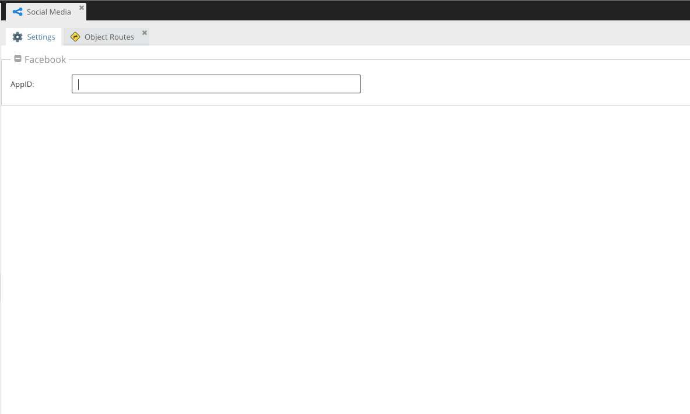
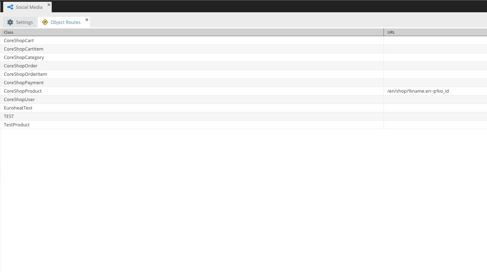
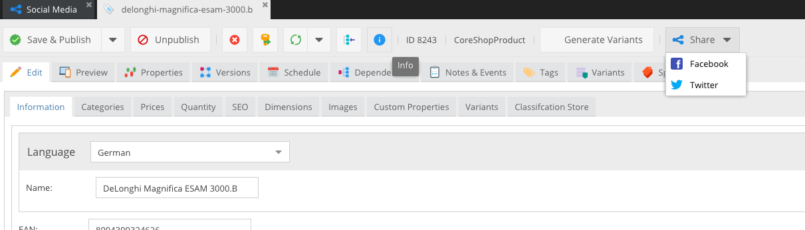

Social Media adds an share button to Documents and Objects. Users can now easily share Documents and Objects through the click of a button.

Every click on the shared-link will be tracked.

### Configuration

#### Facebook

To support Facebook, you need to create a new Application on [developer.facebook.com](developer.facebook.com) and add it to the Social Media Settings.

#### Twitter

No configuration needed for twitter.

## License
[w-vision AG](https://www.w-vision.ch), Sandgruebestrasse 4, 6210 Sursee, Switzerland  
https://www.w-vision.ch, support@w-vision.ch  
Copyright © 2017 w-vision AG. All rights reserved.

For licensing details please visit [LICENSE.md](LICENSE.md)

## Screenshots

