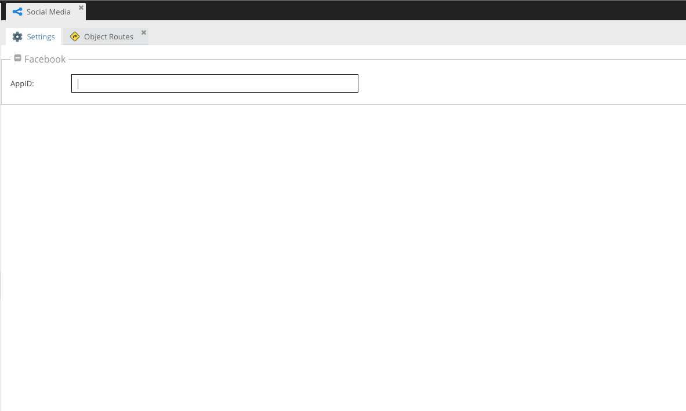
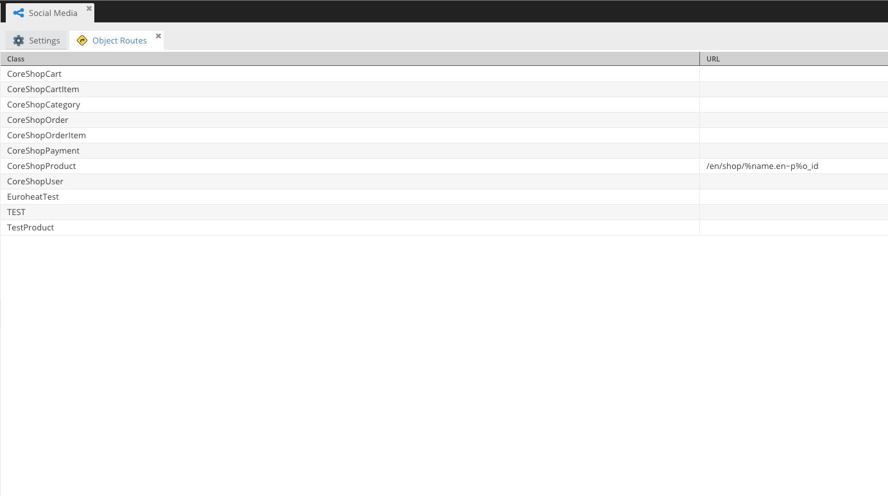
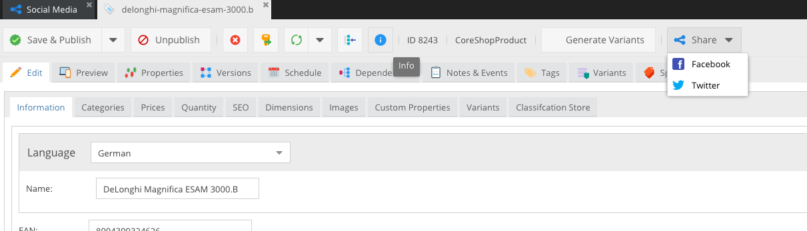

# Pimcore - Social Media

Social Media adds an share button to Documents and Objects. Users can now easily share Documents and Objects through the click of a button.

Every click on this click-button will be tracked through every network.

